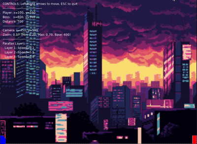

# Parallax Scrolling & Adaptive Zoom Demo

A minimalist, pure-Lua implementation of parallax scrolling with adaptive camera zoom in LÖVE2D.



## Overview

This demo showcases two key game development techniques:

1. **Parallax Scrolling**: Creates depth illusion by moving background layers at different speeds
2. **Adaptive Camera Zoom**: Dynamically adjusts zoom level based on distance between game objects

The result is a responsive camera system that enhances the sense of depth and space in a 2D environment.

## How It Works

### Parallax Effect
- Three background layers move at different speeds (0.2, 0.5, and 0.75)
- Distant backgrounds (lower speed values) move slower than foregrounds
- Each layer's position is calculated based on the camera's offset from world center
- The formula `offsetX = (camera.x - worldCenterX) * (1 - layer.speed)` creates the depth effect

### Adaptive Zoom
- Camera zoom level is inversely proportional to the distance between player and boss
- Formula: `targetZoom = zoomBase / distance` (clamped between min/max values)
- Smoothly interpolates between zoom levels for fluid transitions
- As objects move farther apart, the camera zooms out to keep them in view

## Features

- Clean, modular code structure for educational purposes
- Real-time HUD showing all relevant parameters
- Smooth camera transitions 
- Simple, focused demo isolating parallax and zoom techniques

## Controls

- **Left/Right Arrow Keys**: Move the player character
- **ESC**: Quit the demo

## Technical Implementation

The code is organized into several logical components:

- **Configuration**: Easily adjustable parameters
- **Camera System**: Handles positioning and zoom
- **Parallax Layers**: Background with varying scroll rates
- **Game Entities**: Simple player and boss objects
- **HUD**: Real-time debugging information

## Requirements

- [LÖVE2D](https://love2d.org/) 11.0 or newer

## Running the Demo

```bash
# Clone the repository
git clone https://github.com/your-username/parallax-demo.git

# Navigate to the project folder
cd parallax-demo

# Run with LÖVE
love .
```

## Structure

```
/
├── main.lua          # Main game code
├── screenshot.gif    # Demo animation
├── assets/           # Image resources
│   ├── bg.png        # Background layer (distant)
│   ├── mg.png        # Middle layer
│   └── fg.png        # Foreground layer
└── utils/            # Utility modules
    ├── camera.lua    # Alternative camera implementation
    └── parallax.lua  # Helper functions for parallax effects
```

## License

MIT License - Feel free to use and modify for your own projects.

## Credits

Created by Michael MW. Inspired by classic 2D platformers and their innovative use of parallax effects.

### Assets
- Cyberpunk city background assets from [Cyberpunk Street Environment](https://ansimuz.itch.io/cyberpunk-street-environment) by Luis Zuno (@ansimuz)
